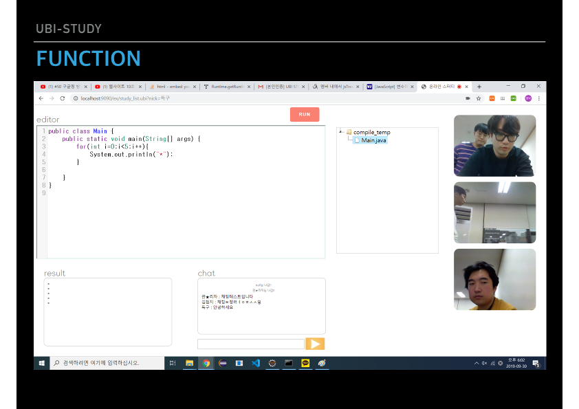

# UBI-Study

> ISSUE
  * 점점 커지고있는 IT시장과 인력 유입으로 인한 코딩 스터디 수요의 증가
  * 좁은 스터디룸, 비싼 스터디룸 대여 비용, 유동인구 밀집지역 이동으로 인한 스트레스 발생
  * 스터디 기회비용에 대한 절약 및 기타 스트레스에서 벗어나고자 하는 욕구의 발생
  
> SOLUTION = UBI-STUDY
  * 기회비용의 대폭 절감
  * 실시간 화상채팅을 통해 상대가 앞에 있는것 처럼 대화하며 스터디
  * 실시간 통신을 지원하는 코드편집기를 통한 다이나믹 스터디 실현
  * 마이크나, 화면 사용이 곤란한 유저를 위한 실시간 채팅 동시 지원
  * 오프라인 팀워크 채널 지원
  
> CREW & SHARE
  * 서영탁 - Server, Study board, WEBRTC, DB, Data Acquisition
  * 이민석 - Design, DB, Board , Data Acquisition
  * 조성주 - About Admin page, Board, DB, Data Acquisition
  * 조용철 - WEBRTC, Presentation, Board, ERD, Data Acquisition
  * 조혁 - DB
  
> SCHEDULE

> ERD

> DEVELOPMENT-ENVIRONMENT

> CONTENTS

> FUNCTION

이메일인증(https://github.com/seo0tak/UBI-Study/tree/master/UBIstudy/src/main/java/ubi/study)

